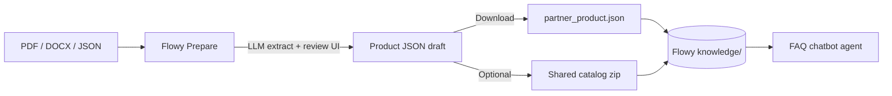

# Flowy Prepare — Knowledge preparation for [Flowy](https://github.com/thangtmc73/flowy)

Web tool to turn partner FAQ documents (PDF/DOCX) or existing product JSON into structured knowledge files for the [Flowy](https://github.com/thangtmc73/flowy) chatbot — multi-partner insurance FAQ on Zalopay, built for [GreenNode Claw-a-thon 2026](https://greennode.ai/events/greennode-claw-a-thon).

> **Disclaimer:** Developed for the hackathon. Platform LLM access and deployed endpoints **may be revoked after the event**. Generated FAQ content is a draft — always review before merging into Flowy. Insurance details in source documents **may become outdated**; verify with the official insurer or Zalopay.

## Team

TramNTQ, ThangTM2, TranVHD

## What is this repo?

**Flowy Prepare** (`flowy-prepare`) is the **knowledge authoring companion** for **[Flowy](https://github.com/thangtmc73/flowy)** (`flowy-agent` locally). It does not run the chatbot itself; it helps operators:

1. Upload **PDF/DOCX** FAQ documents (or import existing **JSON**)
2. Use an **AI agent (LLM)** to extract structured FAQs, suggest partner/product metadata, and split long docs into chunks
3. **Review and edit** drafts in the browser (questions, answers, tags, categories)
4. **Download** formatted JSON ready for Flowy's `knowledge/` tree
5. Optionally generate updated **shared catalog** files (`_index.json`, `comparisons.json`, `general_faqs.json`) from the live Flowy GitHub baseline



## Related repository

| Repo | Role |
|------|------|
| **[thangtmc73/flowy](https://github.com/thangtmc73/flowy)** | Main Flowy agent — chat UI, FAQ search, memory, deploy on AgentBase |
| **[thangtmc73/flowy-prepare](https://github.com/thangtmc73/flowy-prepare)** | This repo — experimental AI-assisted knowledge import (not required to run Flowy) |

After export from Flowy Prepare, copy files into Flowy and follow its validation/sync workflow (`validate_faq.py`, `sync_knowledge.sh`). See [Flowy — Knowledge Base Management](https://github.com/thangtmc73/flowy#knowledge-base-management).

## Features

### Document → FAQ (AI-assisted)

- Parse **PDF** and **DOCX** to plain text (no LLM)
- **LLM extraction** of FAQ entries: `canonical_question`, `user_questions`, `answer`, `category`, `tags`
- Auto-suggest **partner_id**, **product_id**, **category** from document content
- Chunk long documents for multi-pass generation
- Post-process tags for Vietnamese search (accented keywords, no hyphen slugs)

### Review & export

- Edit FAQs in a review UI before export
- Download **pretty-printed** product JSON (`{partner_id}_{product_id}.json`) matching Flowy's schema
- Generate shared knowledge updates against the remote Flowy catalog (GitHub raw)

### JSON import path

- Upload an existing Flowy product JSON to edit or refresh catalog entries
- Check whether partner/product already exists in remote `_index.json`

## Tech stack

- **Backend:** Python 3.13, FastAPI, LangChain OpenAI-compatible client
- **Frontend:** React + Vite + TailwindCSS
- **LLM:** GreenNode AI Platform (OpenAI-compatible API)
- **Deployment:** Docker + nginx + AgentBase Runtime (optional)

## Prerequisites

- Python 3.13+ (or 3.10+)
- Node.js 24+ (frontend dev/build)
- GreenNode **LLM API key** and base URL ([Model Browser](https://aiplatform.console.vngcloud.vn/models))

## Quick start

### 1. Backend

```bash
python3 -m venv venv
source venv/bin/activate
pip install -r requirements.txt
cp .env.example .env
# Edit .env: LLM_MODEL, LLM_BASE_URL, LLM_API_KEY
python3 main.py
```

API default: `http://127.0.0.1:8081` (override with `AGENT_PORT` in `.env`).

### 2. Frontend (development)

```bash
cd frontend
npm install
npm run dev
```

Dev UI: `http://localhost:5173` — proxy/API base configured in `frontend/vite.config.js`.

### 3. Typical workflow

1. Open the UI → **Từ tài liệu (PDF/DOCX)** or **Từ JSON có sẵn**
2. Upload file → confirm partner/product metadata → wait for FAQ generation
3. On **Review** page: edit questions, answers, tags; save draft
4. **Tải JSON sản phẩm** → place under `knowledge/partners/` in [Flowy](https://github.com/thangtmc73/flowy)
5. (Optional) **Done** → generate shared catalog → download zip → merge into Flowy `knowledge/_index.json` and `knowledge/cross_product/`
6. In Flowy repo: validate, sync frontend, commit

```bash
# In flowy repo after copying exported files
python3 scripts/validate_faq.py knowledge/
bash scripts/sync_knowledge.sh
```

## Environment variables

| Variable | Description | Example |
|----------|-------------|---------|
| `LLM_MODEL` | Model for FAQ/metadata extraction | `google/gemma-4-31b-it` or `minimax/minimax-m2.5` |
| `LLM_BASE_URL` | OpenAI-compatible base URL | `https://…/v1` |
| `LLM_API_KEY` | Platform API key | `sk-…` |
| `EXTRACTION_MAX_CHARS` | Max chars per LLM chunk | `12000` |
| `METADATA_MAX_CHARS` | Max chars for metadata suggestion | `10000` |
| `KNOWLEDGE_RAW_BASE_URL` | Remote Flowy knowledge baseline (GitHub raw) | `https://raw.githubusercontent.com/thangtmc73/flowy/refs/heads/master/knowledge` |
| `DATA_DIR` | Runtime data root | `data` |
| `AGENT_PORT` | Backend port | `8081` |

> **Model tip:** Prefer `google/gemma-4-31b-it` for faster document extraction; see Flowy README for model notes.

## LLM usage

Flowy Prepare uses a **single analysis model** (`LLM_MODEL`) for:

- Metadata suggestion (partner, product, category)
- FAQ extraction from document chunks
- Shared catalog updates (`_index.json`, cross-product FAQs)

This is separate from Flowy's runtime chat model. Prepare is an **offline/experimental authoring tool** — quality depends on source document format and human review.

## Output format

Exported product JSON follows Flowy's multi-partner schema (see `knowledge/partners/TEMPLATE.json` in the Flowy repo):

- Pretty-printed (2-space indent, UTF-8)
- Field order aligned with Flowy conventions
- Tags: Vietnamese **with diacritics** and spaces for search; English/partner slugs without hyphens

## Project structure

```
flowy-prepare/
├── main.py                    # FastAPI app + export endpoints
├── requirements.txt
├── Dockerfile                 # Frontend build + Python API + nginx
├── services/
│   ├── document_parser.py     # PDF/DOCX text extraction
│   ├── faq_generator.py       # LLM FAQ generation + tag rules
│   ├── metadata_suggester.py  # Partner/product metadata
│   ├── shared_knowledge_generator.py  # Catalog updates vs GitHub baseline
│   ├── knowledge_remote.py    # Fetch Flowy knowledge from GitHub raw
│   └── product_json.py        # JSON validation + export formatting
├── frontend/                  # Upload + review UI
├── knowledge/                 # Local reference copies (optional)
└── scripts/
    └── validate_knowledge.py  # Schema validation
```

## Validation

```bash
python3 scripts/validate_knowledge.py
```

Run after editing exported JSON or before opening a PR to Flowy.

## Deployment

Docker image serves the built React UI and API on port **8080** (see `Dockerfile`, `start.sh`). GitHub Actions workflow (`.github/workflows/deploy.yml`) can build and deploy to AgentBase Runtime when secrets are configured (`LLM_*`, IAM, runtime ID).

Local Docker:

```bash
docker build -t flowy-prepare:local .
docker run -p 8080:8080 --env-file .env -v flowy-pre-data:/app/data flowy-prepare:local
```

## Experimental scope

Flowy Prepare is **experimental**:

- LLM output requires manual review (accuracy, tags, duplicate FAQs)
- Shared catalog generation proposes updates — verify diffs before merging to Flowy
- For simple Q&A documents, Flowy's CLI import (`scripts/import_partner_docs.py`) may be enough without this UI

Use Prepare when you want a **guided UI**, chunking for long docs, and catalog zip export. Use Flowy's script path for quick one-off imports.

## Links

- **Flowy (main agent):** [github.com/thangtmc73/flowy](https://github.com/thangtmc73/flowy)
- **GreenNode Claw-a-thon:** [greennode.ai/events/greennode-claw-a-thon](https://greennode.ai/events/greennode-claw-a-thon)
- **Model Browser:** [aiplatform.console.vngcloud.vn/models](https://aiplatform.console.vngcloud.vn/models)
- **AgentBase docs:** [docs.vngcloud.vn/agentbase](https://docs.vngcloud.vn/agentbase)

## License

MIT License
